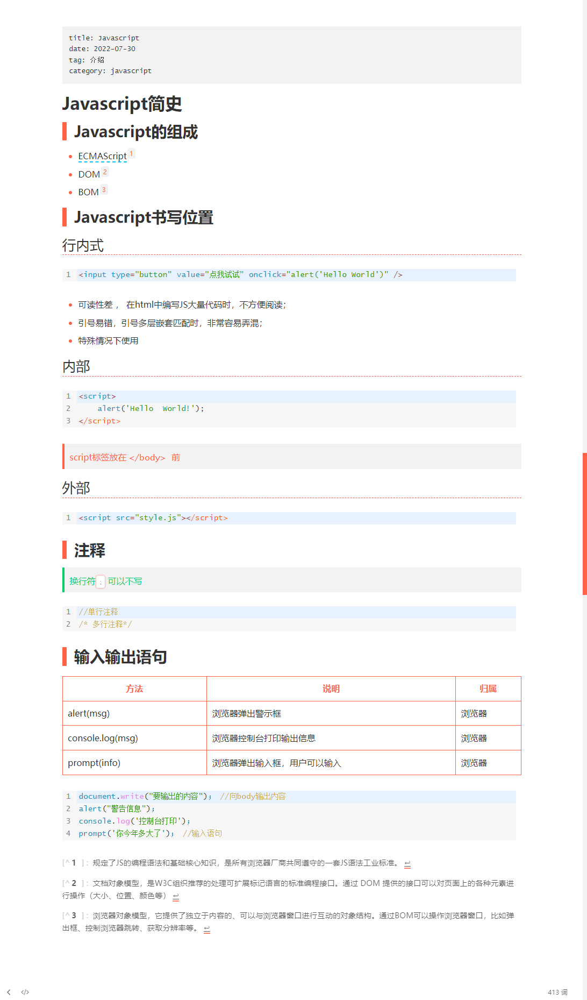
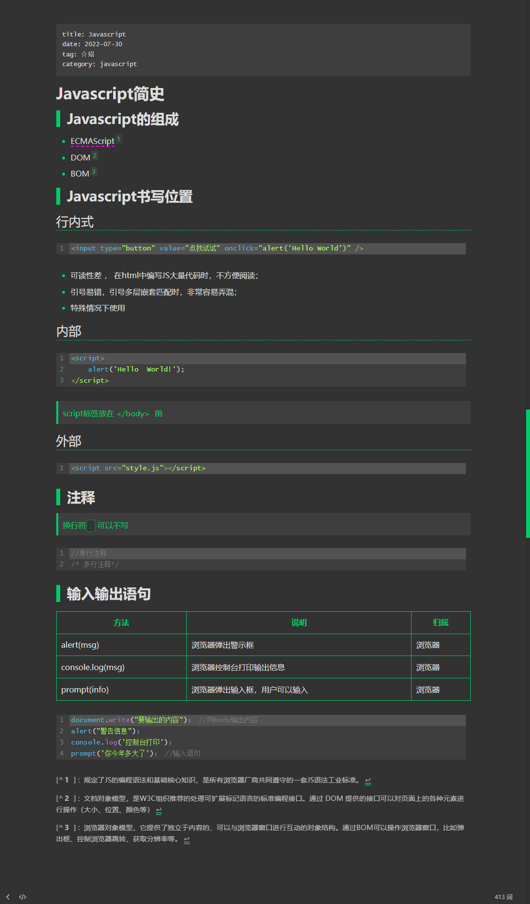

# Typora foresee theme

&emsp;&emsp;&emsp;&emsp;![](https://img.shields.io/badge/dynamic/json?color=white&label=%E7%BD%91%E6%98%93%E4%BA%91%E9%9F%B3%E4%B9%90&query=%24.data.totalSubs&url=https%3A%2F%2Fapi.spencerwoo.com%2Fsubstats%2F%3Fsource%3DneteaseMusic%26queryKey%3D1732207004&logo=data:image/svg+xml;base64,PHN2ZyBpZD0i5Zu+5bGCXzEiIGRhdGEtbmFtZT0i5Zu+5bGCIDEiIHhtbG5zPSJodHRwOi8vd3d3LnczLm9yZy8yMDAwL3N2ZyIgdmlld0JveD0iMCAwIDQyNS4yIDQyNS4yIj48ZGVmcz48c3R5bGU+LmNscy0xe2ZpbGw6I2ZmZjt9PC9zdHlsZT48L2RlZnM+PHRpdGxlPue9keaYk+S6kTwvdGl0bGU+PHBhdGggY2xhc3M9ImNscy0xIiBkPSJNMzIwLjYsNDI1LjJIMTA1LjQyYy0xLjY5LS4yLTMuNC0uNDQtNS4wOS0uNjEtOC4xNy0uODctMTYuNDMtMS4xOS0yNC40OC0yLjY4QzUxLjQxLDQxNy40LDMxLjc3LDQwNSwxNy40NSwzODQuNTYsNy40NSwzNzAuMjksMi44NSwzNTQuMTUsMS4zMywzMzcsLjgxLDMzMS4yNi40NCwzMjUuNTEsMCwzMTkuNzdWMTA3LjA4Yy4yMi0yLjQxLjQzLTQuODIuNjctNy4yMi44My04LjE3LDEuMTYtMTYuNDMsMi41OS0yNC40OSw2LjQ1LTM2LjUyLDM0LjQ5LTY0LjY0LDcxLTcxLjkxQzg5LjQuNDYsMTA0LjcuMSwxMjAsLjA4LDE4NC44MiwwLDI0OS42MS0uMSwzMTQuNC4xN2ExODEuMTIsMTgxLjEyLDAsMCwxLDM0Ljc4LDNjMzYuOTUsNy4zOCw2MS4xOSwyOS4zMyw3MS41Nyw2NS44LDQsMTQuMTgsNC4zNSwyOC44OSw0LjM4LDQzLjUxcS4xNSwxMDAuMDgsMCwyMDAuMTdBMjQzLjU4LDI0My41OCwwLDAsMSw0MjIuNzgsMzQ2Yy0zLjksMjcuMjMtMTcuNjMsNDguNTEtNDAuOCw2My40Ny0xMy43OSw4LjktMjkuMjIsMTIuOTQtNDUuNCwxNC40MUMzMzEuMjIsNDI0LjM3LDMyNS44Nyw0MjQuNzcsMzIwLjYsNDI1LjJaTTI2Ni44NCwxNjQuNzZjMS42OC40MiwyLjY3LjYxLDMuNjIuOTFBNjQuMzgsNjQuMzgsMCwwLDEsMjk2LjA5LDE4MWMzMSwzMC4zNywzMi40Nyw4Mi4zOSwyLjUyLDExNS4xMy0yNy40MSwzMC02MS44NSw0MS41LTEwMS42OSwzNC40OS02OS40Mi0xMi4xOC0xMTAuMS04NS40NS04NC4xMS0xNTAuODksMTEuNTktMjkuMTcsMzIuNDMtNDkuNiw2MS4yNi02Miw5LTMuODYsMTIuODYtMTIuODQsOS4zNC0yMS4xNy0zLjYxLTguNTQtMTIuNzYtMTItMjEuODktOC4yMkExNDIuOTIsMTQyLjkyLDAsMCwwLDc2LjY5LDI1M0M5MSwzMTUsMTQ1Ljg3LDM2MS4xMywyMDkuMTgsMzY0LjE4YzM2LjE3LDEuNzQsNjktOC4zMiw5Ni44Mi0zMS4zOCwzOS41MS0zMi43MSw1NC44My03NC42MSw0MS43MS0xMjQuODEtOC4yNi0zMS42MS0yNy42NS01NS4yMi01Ny44OC02OWExMDIuNTIsMTAyLjUyLDAsMCwwLTI5LjU2LThjLTEtLjE0LTIuNjUtLjgxLTIuODUtMS41NGExOTMsMTkzLDAsMCwxLTQuODktMjAuMSwxNSwxNSwwLDAsMSw4LjMzLTE1LjksMTYsMTYsMCwwLDEsMTcuOSwyLjQ0YzEuNjEsMS40LDMsMyw0LjYyLDQuNDNhMTYsMTYsMCwwLDAsMjIuNTUtMS4zOC42OS42OSwwLDAsMCwuMTEtLjEzYzUuNTMtNi40Miw1LjM0LTE1LjE5LTEtMjIuMTRhNDksNDksMCwwLDAtNzUuNDgsMi44M2MtMTAsMTMuMTMtMTAuOTMsMjgtNyw0My40OS44MSwzLjIsMS42NSw2LjQsMi40NCw5LjM5YTcuMzcsNy4zNywwLDAsMS0uNjEuNWMtMS4yNy4zNi0yLjUzLjcyLTMuOCwxLTE4LjgyLDQuODgtMzUsMTQuMjUtNDcuMzMsMjkuMzYtMTkuMjksMjMuNTctMjUuNDUsNDkuOTMtMTQuMSw3OC44MiwxMi40OSwzMS43OSw0NS45Miw0Ny44Myw3Ny41LDM3Ljc4LDI4LjA4LTguOTQsNDQuNzMtMzUuMzQsNDIuMTEtNjUuMjItLjgzLTkuNjEtMy42Ni0xOS4wOC01LjkyLTI4LjUzQzI3MS4xNiwxNzkuMTUsMjY5LDE3Mi4zMSwyNjYuODQsMTY0Ljc2WiIgdHJhbnNmb3JtPSJ0cmFuc2xhdGUoMCAwKSIvPjxwYXRoIGNsYXNzPSJjbHMtMSIgZD0iTTE4NS42OCwyMTEuNTJjMS0xNy44MywxMS44NS0zMi40OSwzMC4xNS00MS45Miw0LjcyLTIuNDQsMTAuMS0zLjU2LDE1LjE1LTUuMzQsMS43NC0uNjEsMi41Mi0uMTYsMywxLjY4LDMuOTMsMTQuMzcsOC4wOSwyOC42OCwxMS44OCw0My4xMWEzNy4zOSwzNy4zOSwwLDAsMS0uNzYsMjMuMDhjLTcuMzgsMTkuNzctMzIuNDMsMjUuMjUtNDcuODUsMTAuNDdDMTg5LjM0LDIzNSwxODUuNiwyMjUuNjcsMTg1LjY4LDIxMS41MloiIHRyYW5zZm9ybT0idHJhbnNsYXRlKDAgMCkiLz48L3N2Zz4=&labelColor=d62f2e)

[中文](ReadmeCN.md)	|	English

---

## Thanks

This idea is inspired by [typora-dyzj-theme](https://github.com/muggledy/typora-dyzj-theme)

## How to use

1. Typora open menu>theme，click the button`open theme folder`
2. clone this repository
3. copy foldername `Source`and`.css`ending style file，paste into the theme folder

## Preview

### light mode

### Dark mode

## Purpose of use

*   classify my files

*   left the footprint of learning

*   enlighten other's thoughts

